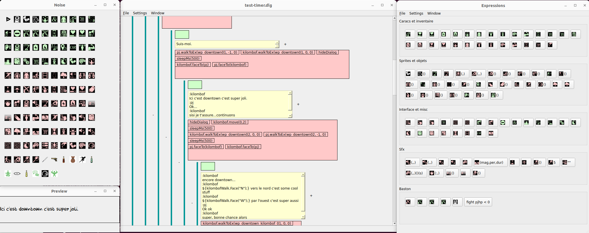

dlgedit: dialog editor for RPG
==============================

Dlgedit is a dialog editor and interpreter aimed for games which require advanced dialog feature such as branching, conditionals, and integration with effects.

It is made of two components:

  - the editor, a Qt application which allow designing dialogs without coding, and produces json files
  - the executor, a C# class that executes the dialog, that needs to be plugged into your game code.

It's main features are:

  - Tree representation of the dialog, with support for "goto".
  - Conditional nodes: a PC/NPC option can be hidden based on some conditions (quest state, PC stats, ...) using drag-and-droppable condition templates.
  - Effects: once displayed a node can perform some actions to change the game state (scrolling the screen, moving a character, ...). Effects can execute in parallel or sequentially.
  - Fast sequence mode for interactions without any branching.

Further reading
---------------

   - User documentation: [User documentation](UserDoc.md)
   - Instructions for integrating the Executor into your game: [Integration](ExecutorIntegration.md).

