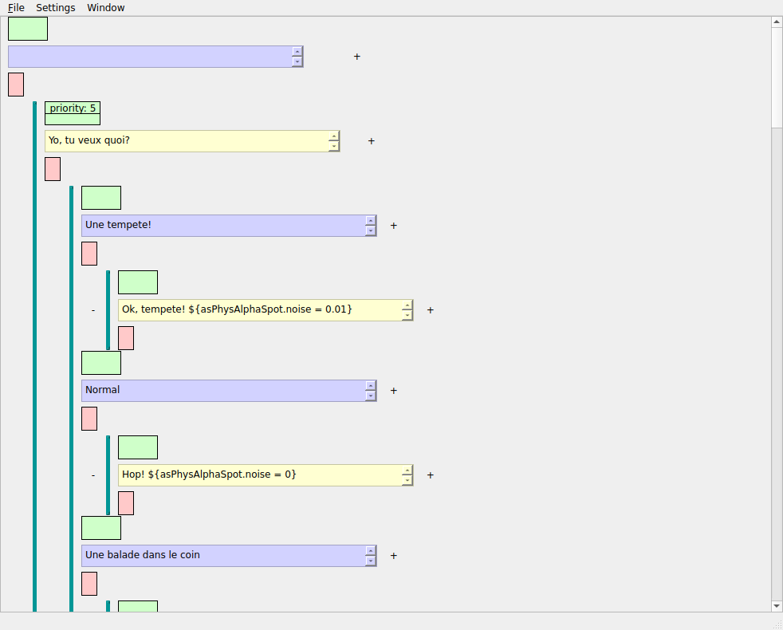

#Dlgedit User Manual

##Introduction

Dlgedit allows scenarist to write complex text-based interactions between the player and NPCs in your game without writing code.

It uses a set of reusable parameterizable condition and effect boxes that scenarists must design with the help of game developers to make dialog nodes conditionally available, and have them perform actions in the game.

## Overview of the execution logic

When your dialog executes, it will start at the root node, pick a child node, executes it, and then go on with the picked node's children.
When choosing between multiple nodes, the system will first filter those with non matching condition, and if multiple remains:

    - If a PC level it will display all dialog options as possible choices to the player
    - If a NPC level it will pick one at random (you can use the 'priority' condition to alter this behavior).

Execution of a node is as follows:

    - Display the text of the node
    - When game code reports validation, executes all the effect boxes. Each effect line is executing in sequence. Within each line all effects are executed in parallel.

## Flow control

When the executor reaches a node without any available children, it signals the game to end the dialog.

It is possible to have a node jump back to any other location in the tree:

    - drop an 'id' condition on the jump target node and give it a name
    - drop a 'jumpto' effect on the jump source, filling the value with the name of the 'id' node.

'jumpto' can also be used to jump to an other dialog file using the 'fileName:node' syntax.

If multiple NPC nodes will be available and you want to force one to be picked, you can use the 'priority' special condition. Default priority is 0, and the executor will pick one node at random among those available with the highest priority value.

Finally, you can make a node be available only once per dialog session using the 'once' special condition, and make it available once only for the whole game using 'single' special condition.

##Dialog Window

This is the main window where you will write your interactions. When saved it produced to files, 'yourdialog.dlg' and 'yourdialog.dlg.json'. The first one is used to reload in dlgedit editor, the second one is a json file used by the dialog executor to run the dialog in your game engine.

It displays a tree of dialog nodes. Eeach node comprises three parts:

    - The condition bar (green background): This where you will drag&drop and parameterize conditions.
    - The text that the PC or NPC will say if this node triggers. Blue background is PC speaking, yellow background is an NPC speaking.
    - The effect bar (red background): this contains multiple lines of effects that will be executed after displaying the dialog.

Nodes can be added as child of the current node using the '+' symbol.

Nodes can be copy or cut and pasted using standard keyboard shortcuts.

Nodes can be deleted using the DEL key.

Use ctrl-return in the text area to trigger between PC and NPC speaking (blue background is PC, yellow background is NPC).

### Sequence mode

If you have a sequence of exchanges between PC and one ore more NPCs, you can avoid a useless hierarchy of nodes and put the whole sequence in a single node text area.
Use shift-return to expand the text line into a text area. Then start a line with a semicolon folowed by a NPC name, or 'pj' for PC (in french, sorry :) ).
Example:

    :pj
    Good morning I would like a bagette please
    :baker
    Sorry sir, we only have croissants

### Variables in text

In PC/NPC text you can use variables that will be expanded before being displayed by enclosing them between '${' and '}' like this:

    Hello ${pcName}, you currently have {pcCharact.health} hit points.

## Condition and effects

Conditions and effects in dlgedit are buttons that you can design. They have:

   - an icon taken from your icon library in 'assets/' folder
   - a list of parameters that you can set by clicking on the button once dropped to a condition or effect bar
   - a displayed text
   - the code to execute by the executor

They are created using the "builder" window and saved in toolboxes, from which you can drag&drop them to your dialogs.

### The builder window

To create a new condition or effect button, hit the "New" button of the builder window. To edit an existing button, drag&drop it from your toolbox to the blank area at the bottom of the builder.

To assing an icon, just click the icon you want from the icon list window. This window spawned by default contain all images in the "assets/" folder.

The first line of text is the expression that will be evaluated by the executor.

It can contain placeholders that will be replaced by actual values: '%o', '%v',
for operator and value, and then "%0" "%1" "%2" ... for extras.

Example: 'pjCharacter.strength %o %v'

The second line of text is what is displayed on the button when it is parameterized.

the 'operator' and 'value' list belows must be filled with possible values for those placeholders, one per line. If you want the value to be freely filled from a text area, check the appropriate 'free' checkbox.

If you need more parameters, use the "extra" text area below.
Line one is for %0, line 2 for %1 and so on.

You can ask the possible choices to be populated from a text file by using "%filname", or free text by using "$free". For instance expr can be 'changeMap("%0")' and the first line of extra '%mapList.txt'.

You can at any point test what you are doing by clicking the button.

Once you are done, drag and drop the button from the bottom part of the builder to a toolbox of your choice (you need to File->"new group" first on the "Expressions" window). It is recommended you hit "new" right away on the builder to not edit the same button again by accident. Don't forget to save the toolbox also.
